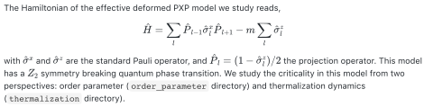
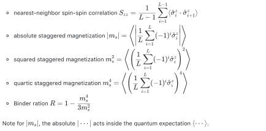

# Open Source Code
<!-- # Open Source Code for arXiv: -->

  

## order_parameter

* `FSS.jl`: performs ED study of various scaling variables and write the result
  for system size L, e.g. `L=7` into `./data/FSS_L7.dat`. Note that open
  boundary condition is used to compare with the experiment (using periodic
  boundary condition can get much accurate estimate of critical point). The
  scaling variables for finite-size scaling (FSS) analysis calculated are

  
  

* `extrapolate.jl`: uses a given scaling variable (controlled by `scaling_choice`)
to perform FSS to estimate the critical point for infinite system size.

### plots
* `FSS.py`: use scaling ansatz to scale the scaling variables such as
  the rescaled values of different system size cross at the same point---the
  critical point. This script produces Fig. S6 in the paper.
* `extrapolate.py`: Due to corrections to scaling, the crossing
  point is not perfect. This file extrapolates the crossing points from sets of two
  consecutive system size L and L+2 to infinite system size to get an
  accurate estimate of the critical point. This script plots Fig. S7 in the paper.

## thermalization
This directory contains files that compare the steady value with thermal value
of certain observables after a quench from the |ℤ₂⟩ state.

* `steady.jl`: performs ED study to calculate the time evolution to extract the
  steady value of various observables.  To this end, we need to first determine
  the relaxation time and them sample data for time after the relaxation
  time. The following two functions serve these purposes:
  - The function `check_relaxation_time(tmax)` produces a list of time
  evolution data points in time `[0, tmax]` which will enable us to determine
  the typical relaxation time.
  - The function `getZ2SteadyValueList4mList(mList)` samples random evolved
  data in time `[t0, 2*t0]` and then average them to get an estimate of the
  steady value. To make sure convergence has been achieved, we repeat this task
  for increasing values of `t0`.

* `thermal.jl`: calculate the thermal values of various observables.

### plots

* `relaxation_time.py`: determines the relaxation time of mₛ ;
* `m_s_steady_thermal.py`: plot the steady and thermal values of mₛ as a
  function of `m`;
* `convergence.py`: plots the calculated steady value in `[t0, 2*t0]` as a
  function of `t0` to check convergence.
* `time_evolution.py`: plots Fig. S8 in the paper.

